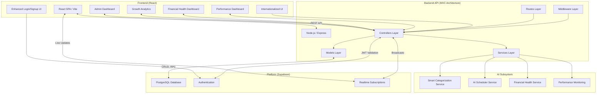

# Monity – AI-Powered Personal Finance Tracker

> **Mission:** *Make budgeting delightfully fast, powerfully intelligent, and totally transparent.*

[](https://opensource.org/licenses/MIT)


---

## Table of Contents

1.  [Why Monity?](#why-monity)
2.  [Feature Highlights](#feature-highlights)
3.  [Current Architecture](#current-architecture)
4.  [Project Layout](#project-layout)
5.  [Getting Started](#getting-started)
6.  [API Reference](#api-reference)
7.  [Data Model](#data-model)
8.  [Security](#security)
9.  [Testing](#testing)
10. [Configuration](#configuration)
11. [Deployment](#deployment)
12. [Recent Updates](#recent-updates)
13. [Roadmap](#roadmap)
14. [License](#license)
15. [About](#about)

---

## Why Monity?

*   **🧠 Truly Smart**: Goes beyond basic ledgers with a custom-trained AI model that learns your spending habits to automate tedious data entry.
*   **Modern Web Stack**: A robust Node.js + Express API with MVC architecture powers a snappy, responsive React/Tailwind UI with beautiful animations and modern design.
*   **👥 Built for Collaboration**: The only finance tracker you'll find with real-time expense splitting for groups, perfect for trips with friends, roommates, and family.
*   **📊 Advanced Analytics**: Comprehensive admin dashboard with growth metrics, user analytics, and system health monitoring.
*   **🌐 Fully Internationalized**: A comprehensive bilingual interface (English & Portuguese) with 500+ translation keys makes it accessible to a global audience.
*   **🎨 Beautiful & Functional UI**: A mobile-first dashboard with interactive charts, modern authentication forms, and a gorgeous dark mode.
*   **🏗️ Clean Architecture**: Properly structured MVC architecture with separation of concerns for maintainability and scalability.

---

## Feature Highlights

| Category | Highlights |
| :--- | :--- |
| **🤖 AI & Automation** | **Smart Categorization** using a Naive Bayes classifier & NLP • **Continuous learning** from user feedback • **Scheduled daily model retraining** with `node-cron` • **Real-time accuracy tracking** • **Performance monitoring dashboard**. |
| **👥 Collaboration** | Real-time **expense splitting** in groups • User search & invitations • Shared expense tracking and settlement • **Group invitation system** with email notifications. |
| **📈 Analytics & Admin** | **Enhanced admin dashboard** with growth metrics • User analytics (premium vs free) • Monthly trends • Category usage stats • System health monitoring • **AI performance tracking** • **Performance dashboard** with real-time metrics. |
| **🔐 Security & Auth** | **Modern login/signup UI** with password strength indicators • Secure **JWT authentication** via Supabase • **Role-Based Access Control** (`user`, `premium`, `admin`) • Enhanced form validation • **Encryption middleware** for sensitive data. |
| **🌐 UX & Design** | **Enhanced authentication forms** with animations • **Comprehensive English & Portuguese** support with 500+ translation keys • **Responsive, mobile-first** design • Real-time UI updates • **Modern gradient backgrounds** • Password visibility toggles • **Financial health dashboard** with personalized insights. |
| **🏗️ Architecture** | **MVC Architecture** with proper separation of concerns • **Service layer** for business logic • **Middleware** for cross-cutting concerns • **Model layer** for data operations • **Controller layer** for request handling • **Route layer** for API endpoints. |

---

## Current Architecture

Monity has been refactored to follow a proper MVC (Model-View-Controller) architecture, providing better separation of concerns, maintainability, and scalability.



**MVC Layer Breakdown**

| Layer | Tech | Responsibilities |
| :--- | :--- | :--- |
| **Models** | Supabase Client + SQL | Data structure, validation, and database operations |
| **Controllers** | Express.js | Process requests, coordinate between models and services, return responses |
| **Services** | Node.js modules | Business logic and complex operations (AI, financial health, performance) |
| **Routes** | Express Router | Define API endpoints and delegate to controllers |
| **Middleware** | Express.js | Handle cross-cutting concerns (auth, validation, encryption, error handling) |
| **Frontend** | React 19 + Vite + Tailwind CSS | **Enhanced UI components** • Modern auth forms • **Admin analytics dashboard** • Interactive charts & widgets • **Fully internationalized interface** • Client-side routing. |

---

## Project Layout

```
Monity/
├── backend/
│   ├── server.js                    # Main application entry point
│   ├── config/                      # Configuration files
│   │   ├── database.js              # Database configuration
│   │   ├── env.js                   # Environment configuration
│   │   └── supabase.js              # Supabase client setup
│   ├── models/                      # Data models (MVC)
│   │   ├── User.js                  # User model
│   │   ├── Transaction.js           # Transaction model
│   │   ├── Category.js              # Category model
│   │   ├── Group.js                 # Group model
│   │   ├── SavingsGoal.js           # Savings goal model
│   │   └── index.js                 # Model exports
│   ├── controllers/                 # Business logic (MVC)
│   │   ├── authController.js        # Authentication logic
│   │   ├── transactionController.js # Transaction handling
│   │   ├── categoryController.js    # Category management
│   │   ├── groupController.js       # Group operations
│   │   ├── savingsController.js     # Savings goals
│   │   ├── adminController.js       # Admin analytics
│   │   ├── aiController.js          # AI features
│   │   └── index.js                 # Controller exports
│   ├── routes/                      # API endpoints (MVC)
│   │   ├── auth.js                  # Authentication routes
│   │   ├── transactions.js          # Transaction routes
│   │   ├── categories.js            # Category routes
│   │   ├── groups.js                # Group routes
│   │   ├── savings.js               # Savings routes
│   │   ├── admin.js                 # Admin routes
│   │   └── index.js                 # Route aggregation
│   ├── services/                    # Business services (MVC)
│   │   ├── smartCategorizationService.js # AI categorization
│   │   ├── aiSchedulerService.js    # AI scheduling
│   │   ├── expenseSplittingService.js # Group expenses
│   │   ├── financialHealthService.js # Financial insights
│   │   ├── performanceService.js    # System monitoring
│   │   └── index.js                 # Service exports
│   ├── middleware/                  # Cross-cutting concerns (MVC)
│   │   ├── auth.js                  # Authentication middleware
│   │   ├── validation.js            # Input validation
│   │   ├── encryption.js            # Data encryption
│   │   ├── errorHandler.js          # Error handling
│   │   └── index.js                 # Middleware exports
│   ├── utils/                       # Utility functions
│   ├── migrations/                  # Database migrations
│   └── __tests__/                   # Comprehensive test suite
├── frontend/
│   ├── src/
│   │   ├── components/              # Enhanced UI components
│   │   │   ├── AdminDashboard.jsx   # Comprehensive admin analytics
│   │   │   ├── FinancialHealth.jsx  # Financial wellness dashboard
│   │   │   ├── PerformanceDashboard.jsx # System performance monitoring
│   │   │   ├── FinancialProjections.jsx # AI-powered forecasting
│   │   │   ├── Login.jsx            # Modern authentication UI
│   │   │   └── Signup.jsx           # Enhanced signup with validation
│   │   ├── utils/
│   │   │   ├── locales/             # Internationalization
│   │   │   │   ├── en.json          # English translations (500+ keys)
│   │   │   │   └── pt.json          # Portuguese translations (500+ keys)
│   │   │   └── i18n.js              # i18n configuration
│   │   ├── hooks/                   # Custom React hooks
│   │   ├── context/                 # AuthContext for global state
│   │   └── App.jsx                  # Main router
│   └── package.json                 # Frontend NPM dependencies
├── docs/                            # Screenshots, diagrams
├── migrations/                      # Database migrations
└── README.md
```

---

## Getting Started

### Prerequisites

| Tool | Minimum Version | Notes |
| :--- | :--- | :--- |
| **Node.js** | 18 | Includes npm |
| **Supabase** | Cloud Account | Used for DB, Auth, and Realtime |

### Local Setup

1.  **Clone & Enter**
    ```bash
    git clone https://github.com/leo-stuart/Monity.git && cd Monity
    ```
2.  **Configure Supabase**
    *   Create a new project on [Supabase](https://supabase.com/).
    *   Navigate to the **SQL Editor**.
    *   Execute the content of `supabase_schema.sql`, followed by all `migration_*.sql` files to set up the database.
3.  **Install Backend Dependencies**
    ```bash
    cd backend && npm install
    ```
4.  **Install Frontend Dependencies**
    ```bash
    cd ../frontend && npm install
    ```
5.  **Set Environment Variables**
    *   In the `backend` directory, copy `.env.example` to `.env` (if available) or create it.
    *   In the `frontend` directory, create a `.env` file.
    *   Fill in the variables as described in the [Configuration](#configuration) section using the API keys from your Supabase project settings.

### Running the Stack

Open **two** separate terminals:

```bash
# Terminal 1 – REST API (Port 3001)
$ cd backend
$ npm start

# Terminal 2 – Vite Dev Server (Port 5173)
$ cd frontend
$ npm start
```

Visit **[http://localhost:5173](http://localhost:5173)** to use the application.

---

## API Reference

Authentication is handled via JWT Bearer tokens obtained from Supabase. The backend API provides over 50 endpoints including comprehensive admin analytics, all following the new MVC architecture.

### Selected Endpoints

| Method | Path | Description |
| :--- | :--- | :--- |
| `POST` | `/ai/suggest-category` | Returns AI-powered category suggestions for a transaction description. |
| `POST` | `/ai/feedback` | Submits user feedback to the AI model for continuous learning. |
| `GET` | `/ai/stats` | Returns AI categorization performance metrics (admin only). |
| `GET` | `/admin/analytics` | Comprehensive growth and user analytics (admin only). |
| `GET` | `/admin/trends` | Daily activity trends and user engagement metrics (admin only). |
| `GET` | `/financial-health` | Returns personalized financial health score and recommendations. |
| `GET` | `/performance/stats` | System performance metrics and health indicators. |
| `POST` | `/groups` | Creates a new expense-splitting group. |
| `GET` | `/groups/:id`| Fetches details, members, and expenses for a specific group. |
| `POST` | `/shares/:id/settle` | Settles a debt within a group, creating the corresponding transactions. |

### New Admin Analytics Endpoints

The enhanced admin dashboard now provides comprehensive insights:

* **User Growth**: Total users, premium vs free breakdown, recent signups
* **Financial Metrics**: Transaction volumes by type, total platform volume
* **Engagement**: Daily active users, transaction trends, category usage
* **AI Performance**: Categorization accuracy, model metrics, feedback analysis
* **System Health**: Database status, API performance, real-time monitoring
* **Financial Health**: User financial wellness scores and trends

---

## Data Model

The data is stored in a relational PostgreSQL database managed by Supabase. Key tables include:

*   `profiles`: Stores user data with subscription tiers, extending `auth.users`.
*   `transactions`, `categories`, `budgets`: Core financial tracking tables.
*   `groups`, `group_members`, `group_expenses`: Powers the expense-splitting feature.
*   `categorization_feedback`, `ml_training_data`, `ml_model_metrics`: Store data for the AI feedback loop and model retraining with performance tracking.
*   `financial_health_metrics`: User financial wellness scores and recommendations.

---

## Security

*   **Enhanced Authentication**: Modern login/signup UI with password strength indicators and real-time validation.
*   **Authorization**: Role-Based Access Control (RBAC) with enhanced admin endpoints for platform analytics.
*   **Password Security**: Strong password enforcement with visual strength indicators and comprehensive validation.
*   **Data Protection**: User passwords are handled and hashed securely by Supabase Auth.
*   **Encryption**: Sensitive data is encrypted using middleware for additional security.
*   **Input Validation**: Comprehensive validation middleware for all API endpoints.

---

## Testing

The project includes a comprehensive test suite for both frontend and backend, with proper test configuration for the new MVC architecture.

```bash
# Run backend tests
$ cd backend && npm test

# Run frontend tests
$ cd frontend && npm test
```

**Note**: Frontend tests may require i18n setup for full functionality.

---

## Configuration

Create `.env` files in both the `backend` and `frontend` directories.

**`backend/.env`**
```env
# The URL of your Supabase project
SUPABASE_URL=https://<your-project-ref>.supabase.co

# The service_role key (secret) for admin-level API access
SUPABASE_KEY=<your-supabase-service-role-key>

# The anon key (public) for user-level API access
SUPABASE_ANON_KEY=<your-supabase-anon-key>

# The port for the backend server
PORT=3001
```

**`frontend/.env`**
```env
# The URL of your Supabase project
VITE_SUPABASE_URL=https://<your-project-ref>.supabase.co

# The anon key (public) for the Supabase client
VITE_SUPABASE_ANON_KEY=<your-supabase-anon-key>

# The URL of your running backend API
VITE_API_URL=http://localhost:3001
```

---

## Deployment

The frontend and backend are deployed as separate services.

*   **Backend**: Can be deployed to any Node.js hosting provider like Render or Heroku. Remember to set the environment variables in your hosting provider's dashboard.
*   **Frontend**: As a static site, the `frontend/dist` folder (created by `npm run build`) can be deployed to services like Vercel or Netlify.

---

## Recent Updates

### 🌐 Comprehensive Internationalization (Latest)
- **500+ Translation Keys**: Complete coverage of all UI elements in English and Portuguese
- **New Translation Sections**: Financial health, performance dashboard, AI features, invitations, data export, financial projections
- **Localized Components**: All major components now support both languages
- **Cultural Adaptation**: Proper localization for date formats, currency, and user experience

### 🏗️ MVC Architecture Refactoring
- **Clean Architecture**: Proper separation of concerns with Models, Views (API), Controllers, and Services
- **Service Layer**: Dedicated services for AI, financial health, performance monitoring, and business logic
- **Middleware Layer**: Authentication, validation, encryption, and error handling middleware
- **Route Organization**: Clean API endpoint organization with proper controller delegation
- **Model Layer**: Structured data models with Supabase integration

### 📊 Enhanced Financial Features
- **Financial Health Dashboard**: Personalized financial wellness scoring with AI-powered recommendations
- **Performance Monitoring**: Real-time system performance metrics and health indicators
- **AI-Powered Projections**: Financial forecasting based on user spending patterns
- **Advanced Analytics**: Comprehensive financial insights and trend analysis

### 🎨 Enhanced UI/UX
- **Modern Authentication**: Completely redesigned login and signup forms with:
  - Animated gradient backgrounds
  - Password strength indicators
  - Real-time form validation
  - Show/hide password functionality
  - Smooth animations and micro-interactions
- **Responsive Design**: Mobile-optimized authentication flows
- **Enhanced Security**: Strong password enforcement with visual feedback

### 📊 Advanced Admin Dashboard
- **Comprehensive Analytics**: Growth metrics, user breakdowns, financial insights
- **Real-time Monitoring**: System health indicators, API performance tracking
- **User Engagement**: Active user metrics, transaction trends, category analytics
- **AI Performance**: Categorization accuracy tracking, model performance metrics
- **Visual Improvements**: Modern card designs, interactive elements, professional styling

### 🚀 Backend Enhancements
- **New Admin Endpoints**: `/admin/analytics` and `/admin/trends` for comprehensive platform insights
- **Enhanced Data Processing**: Monthly growth tracking, user activity analysis
- **Performance Monitoring**: AI model accuracy tracking and performance metrics
- **Improved Security**: Enhanced admin-only endpoints with proper authorization

---

## Roadmap

| Quarter | Milestone |
| :--- | :--- |
| **Q1-2025** | **Enhanced Charts**: Interactive data visualizations for admin dashboard and user analytics. |
| **Q2-2025** | **Mobile App**: React Native mobile application with offline sync capabilities. |
| **Q3-2025** | **Plaid Integration**: Connect directly to bank accounts to import transactions automatically. |
| **Q4-2025** | **Advanced AI Insights**: Implement financial forecasting and anomaly detection features. |
| **Q1-2026** | **Dockerization**: Provide a `docker-compose.yml` for easy, one-command local setup. |
| **Q2-2026** | **Additional Languages**: Support for Spanish, French, and German translations. |

---

## License

Distributed under the **MIT License**. See the [LICENSE](LICENSE) file for details.

---

## About

Monity is an educational side-project by [Leo Stuart](https://github.com/leo-stuart). Contributions and PRs are welcome!

*Built with ❤️ using modern web technologies, clean architecture principles, and a focus on user experience and internationalization.*